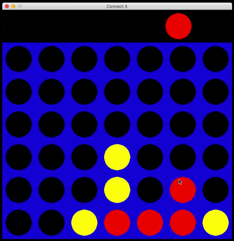

[](https://classroom.github.com/open-in-codespaces?assignment_repo_id=11724411)
# Sistemas Operativos. Práctica 01: Introducción a C

## 1. Objetivo
El objetivo de esta práctica es que el estudiante se familiarice con el lenguaje de programación C a través de la resolución de un problema sencillo. En especifico esperamos que se familiarice con los siguientes conceptos: el paradigma estructural, uso de arreglos, uso de apuntadores, uso de estructuras, uso correcto de memoria en el heap y en el stack, y uso de cadenas de caracteres.

## 2. Introducción

### 2.1 Git
GIT es el sistema de control de versiones, que vamos a utilizar para todas las prácticas de este curso. Por lo que es importante que estés familiarizado con las operaciones básicas de git y con su funcionamiento elemental. Algunos conceptos importantes incluyen:

* __Tracked__ y __Untracked__ Files.
* __Working Area__, __Staging Area__, __Commits__.
* __Branches__ y __Merging Strategies__.

Puedes consultar algunos de estos conceptos y otros más en las notas de clase y en los siguientes enlaces

* [Documentación de Atlassian](https://www.atlassian.com/git/tutorials/what-is-version-control)
* [Libro Pro GIT](https://git-scm.com/book/en/v2)

### 2.2 Docker
Para todas las prácticas del curso utilizaremos un _contenedor_ de __Docker__  que incluye las herramientras necesarias para compilar y ejecutar el código en el que trabajarás.

Primero necesitarás instalar __Docker__  en tu sistema operativo, y una terminal que pueda ejecutar scripts de bash. En estos enlaces puedes encontrar instrucciones de cómo instalar __Docker__ en tu sistema operativo.

* [Linux](https://docs.docker.com/install)
* [MacOS](https://docs.docker.com/docker-for-mac/install/)
* [Windows](https://docs.docker.com/docker-for-windows/)

Una vez que tengas instalado Docker, posiciona la terminal en el direcrtorio raíz de esta práctica y ejecuta el comando `./docker-open-terminal`. Este comando ejecutara las siguientes acciones:

* Descargar y construir localmente una imagen de ubuntu con las herramientas necesarias para trabajar con esta práctica.

* Inicializar un contenedor utilizando la imagen previamentre construida y ejecutar el commando `sleep 7d` para mantener el contenedor ejecutandose por tiempo indefinido.

* Inicializar una terminal bash dentro del contenedor antes creado.

Para windows hay dos opciones, instalar una terminal que acepte comando de bash como [cygwin](https://www.cygwin.com) o adaptar el script `docker-open-terminal` para que funcione en la terminal de windows.

Después de haber ejecutado `docker-open-terminal` podras correr cualquier comando dentro del contenedor. Los comandos disponibles para resolver esta práctica son:

• `make compile` compila el código fuente que se encuentra en el directorio __src__ utilizando el contenedor de docker.

• `make check` ejecuta las pruebas que verifican que tu implementación refleje la especificación..

• `make clean` elimina el archivo ejecutable generado con la acción ` compile`.

### 2.3 Compilador de C (GCC)

Para este curso utilizaremos gcc como compilador de C. En los sistemas operativos tipo Unix, gcc es un programa que puede ser invocado desde una terminal. Así que asumiendo que tienes una terminal abierta, ejecuta la siguiente instrucción:

```bash
$ gcc --version
```

Puedes ejecutar este comando usando la terminal que `./docker-open-terminal` crea.

Lo anterior desplegará un resumen de la versión de gcc que está instalada en tu sistema. Usualmente los archivos que contienen código fuente de C tienen como extención .c, por ejemplo un archivo que contiene un programa en C podría llamarse `hola_mundo.c`. Para compilar el archivo `hola_mundo.c`, asumiendo que el directorio actual de trabajo lo contiene, tenemos que ejecutar un comando como el siguiente dentro de una terminal:

```bash
$ gcc -Wall -Werror -o mi_programa hola_mundo.c
```

Si el archivo `hola_mundo.c` no tiene errores de sintaxis ni de semántica, el comando anterior crea un archivo ejecutable con el nombre `mi_programa`. El comando anterior utiliza algunas banderas de compilación de **gcc**, a continuación una breve descripción de cada una de ellas:

* `-Wall`: le indica a gcc que nos proporcione advertencias que involucren posibles errores semáticos dentro del programa, esta bandera no recibe argumentos, es muy recomendable utilizar para evitar algunos errores de ejecución.

* `-Werror`: le indica a gcc que trate las adventencias como errores, es decir, no genera el ejecutable hasta que los corrijamos.

* `-o`: le indica a gcc el nombre que vamos a dar al ejecutable generado como consecuencia del proceso de compilación.


### 2.4 Referencias para aprender C

En internet existen una gran variedad de referencias y tutoriales para aprender C y para consultar su API, así que eres libre de consultar los materiales que tú desees, en particular puedes descargar un buen libro de la siguiente dirección:

http://cslibrary.stanford.edu/101/

Para consultar el API puedes consultar el siguiente sitio:

http://www.cplusplus.com/reference/

Cabe mencionar que ambas fuentes para algunos componentes están enfocados a sistemas operativos tipo unix.

## 3. Problema

### 3.1 Descripción de "Conecta 4"
En el juego de Conecta 4 se utiliza un tablero de `6 x 7` en el que dos jugadores toman turnos para tirar fichas circulares de un color diferente dentro de este, para ello deben de elegir una columna que aun no esté llena y en ella dejan caer una ficha correspondiente a su color. Gana el primer jugador que logra posicionar 4 fichas consecutivas del mismo color en forma horizontal, vertical o diagonal.



### 3.2 Requerimientos
Para esta práctica vamos a trabajar con una versión muy simple pero genérica de este juego, en donde el tamaño del tablero, el número de los jugaderos y el número de fichas consecutivas para ganar son parametrizables. No tendremos una interfaz gráfica, pero en su lugar vamos a tener una serie de pruebas automatizadas que verificarán que tu implementación es correcta.
 1. En el archivo `src/connect4.h`  tienes que agregar los atributos necesarios para representar un tablero para jugar este juego.
 2. Lee cuidadosamente la descripción de las funciones que se encuentran en el archivo `src/connect4.h`, luego implementa cada una de ellas en el archivo `src/connect4.c`, en este último ya se encuentra el cascaron de cada una de estas funciones.
 3. Para verificar que tu implementación refleja correctamente la especificación, corre las pruebas del proyecto por medio de docker. Para ello sigue estos pasos:
    - Inicia Docker en tu computadora, debe de estar corriendo el demonio para poder ejecutar cualquier de los siguiente comandos.
    - Ejecuta el comando `./docker-open-terminal`, el cual construye la imagen de docker que utilizarás para compilar y correr el código.
    - Dentro de la terminal bash que `docker-open-terminal` ejecuta, puedes compilar el código y ejecutar las pruebas utilizando el comando `make` o `make check`. Si pasas todas las pruebas vas a obtener una salida como esta:
    ```
    make compile
    make check
    Prueba to_string empty_board: PASS
    Prueba to_string nonempty_board: PASS
    ...
    ...
    SUMMARY 22/22 PASS
    TESTS SUCCEDED
    ```
    Si alguna prueba falla, este comando te va a dar retroalimentación de qué es lo que se esperaba y qué encontró en el resultado producido por tu código. Puedes encontrar las salidas esperadas de cada una de las pruebas en el directorio `expected-outputs`, por ejemplo la prueba `to_string empty_board` tiene su salida esperada en el archivo `expected-outputs/to_string-test-empty_board.output`, mientras que la salida real de tu implementación la puedes encontrar en el archivo `outputs/to_string-test-empty_board.output`.
    - Para ejecutar solamente la prueba `to_string empty_board`,utiliza el comando `./practica01 to_string empty_board`. Recuerda primero compilar el código con tus últimos cambios usando el comando `make compile`.
    - En Github Workflow las pruebas también deben de pasar. Puedes verificar esto en el Pull Request que fue abierto como parte de tu entrega, en la pestaña llamada `Checks`.

## 4. Entrega

Para esta práctica, al momento de aceptar la tarea en Github Classroom se crea un fork del `template repository` que preparamos, por lo que no tendrás que crear un repositorio dentro de GitHub por ti mismo. Es importante mencionar que para esta práctica tienes que subir todo el código de tu solución a la rama **main**. Github Classroom crea por ti un Pull Request llamado **Feedback** en tu repositorio que compara tus cambios en `main` contra el código base que te fue entregado, es aquí donde agregaremos todos los comentarios al momento de calificar así como también conocerás qué calificación obtuviste en cada aspecto que evaluamos de esta práctica.